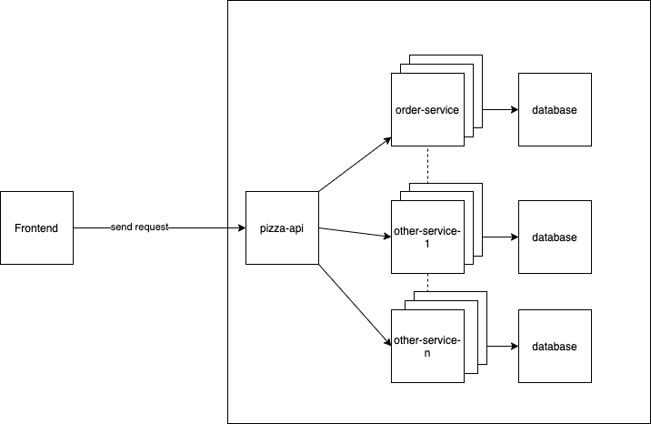

# Pizza Joint Project

In this project, I use `docker-compose` to create services within same network and the services can communicate with each others internally.

# How to run?

There is a `Makefile` for handling the tasks of building project and dockerization.

```
1. make build
2. make dockerize
3. make run-docker
```

if you want to stop docker services, you can run `make stop-docker`.

Entrypoint: POST `http://localhost/pizza`

# High Level Design

`pizza-api` acts as a gateway for user to call the api in frontend, after the traffic coming to our app, pizza-api will then forward it to `order-service`. After that, `order-service` creates pizza order and save it to `MySQL`.


# Security

`HTTPS`: To secure our endpoint and traffic, `HTTPS` must be applied to encrypt user traffic and data. In this project, for demo purpose, I just use `HTTP`, but in production environment, we must use `HTTPS`.

`Encryption`: In real use case, when ordering pizza, the payment process will be involved in our system, we need to deal with the payment data carefully, if the data is sensitive, we must do `Encryption` on such data or Don't store it if we don't need such data.

In this project, only `pizza-api` is exposed to the public, other services are not exposed due to security reason. The services can only communicate internally or through `pizz-api`. That means, we can control our public traffic in `pizza-api` or before `pizza-api` such as load balancer.

In this project, I hardcoded the credentials in YAML file, but we should use more secure approach to manage the credentials in production environment such as `Git-Secret` or `Vault` to encrypt the credentials.
# Scaling

This design can be further improved by scaling the instances horizontally when there is high traffic coming to our system. As the image presented, we can scale our microservices to serve user traffic.


To achieve this, we can utilize `Kubernetes` to help us manage our containers and resources.
`Kubernetes` can provide our system scalability and monitor our resources.

If the bottleneck is database, we can do master-salve replication on database to increase the database performance. After we applied master-slave strategy, we can separate the read/write traffics and let the traffic distribute to different database instances. The date will be written to master and
sync to slaves and read request will go to slaves. It provides more availability characteristic to the system but we trade off the data consistency because when data synchronize to slaves, there is possible to have latency.

If there is lot of data in the database and the query become slow, we can do sharding on database like separating the order by month:

```
pizza-order-2021-09
pizza-order-2021-10
pizza-order-2021-11
...
etc.
```

after that, we can distribute our data horizontally and the query speed will be improved as we don't store numerous data inside one table.

But definitely, the architecture complexity will be increased if we do sharding on database, because we need to write our own hashing function to route the traffic to different table or different database.

# Further Discussion

## Real-time order tracking

We can adopt `Kafka` as message stream middleware to process the data asynchronously and use `Server-sent Events` technique to stream the data to client side for real time order tracking. For example, when the order is created,it may go through few statuses when the pizza joint process the order (
e.g CREATED, PROCESSING, DELIVERING, DELIVERED etc.). We can utilize the said techniques to monitor the status and push the latest status to users for order tracking.

On Pizza Joint side, we also can utilize this technique to let the pizza joint staffs know the latest orders in real-time. When the order is created in backend, it pushes to staff portal to notify the staffs immediately. 

